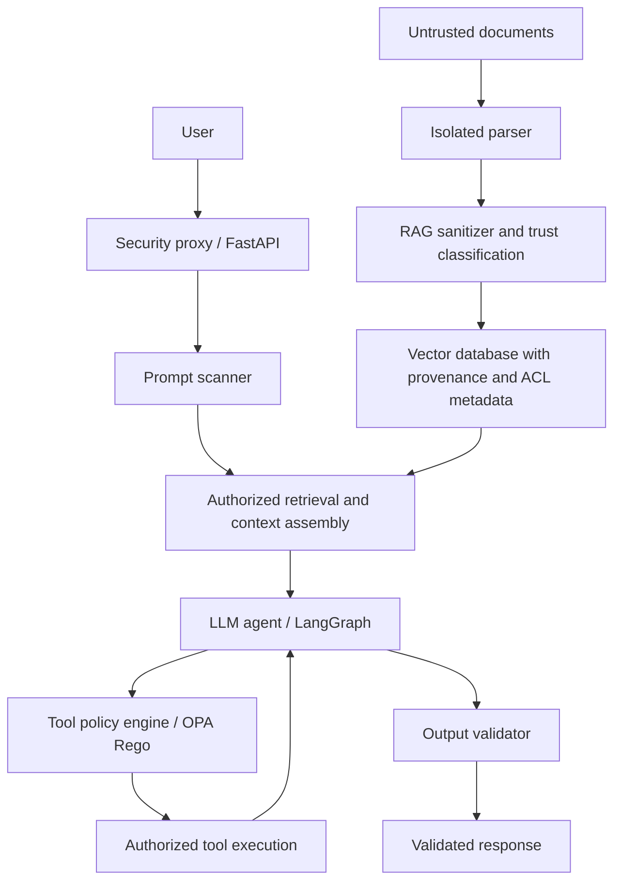

# RagSec — AI/RAG Security Firewall

RagSec is an upgrade and enhancement of [Chatbot-USMS](https://github.com/ALLAKORI/Chatbot-USMS.git), evolving an academic RAG assistant into an experimental security firewall for AI applications. The protected lab detects hostile inputs, enforces data and tool permissions, validates outputs, and measures deterministic controls against repeatable owned-lab attacks.

## Current status

This repository contains the inherited comparison application and a separate protected FastAPI gateway. The protected gateway, OPA policies, bounded LangGraph path, ingestion lifecycle, isolated parser, scoped Qdrant retrieval, citations, cache/deletion controls, mock tool and memory boundaries, protected Compose profile, tests and deterministic benchmark are implemented. Launching the original application still runs the baseline; use `compose.protected.yml` and `/secure` for the protected lab. See [implementation evidence](docs/implementation-report.md) and the [OWASP assessment](docs/owasp-assessment.md).

The baseline was cloned from the local Chatbot-USMS checkout at commit `a652260ec8e09507b3a23f5bf1673f95500736b8` because GitHub cloning required unavailable authentication. A fresh Git history is used for RagSec. See [provenance](docs/provenance.md).

## Target architecture



Security decisions must combine deterministic limits, authorization and policy enforcement. Optional Llama Guard / Prompt Guard or another classifier supplies an additional signal; it must never be the sole security boundary.

## Stack

| Technology | Role | Status |
|---|---|---|
| Python / FastAPI | Baseline API and protected gateway | Implemented |
| LangGraph | Bounded agent and tool orchestration | Implemented in protected lab |
| Qdrant | Scoped vector retrieval and versioned index | Implemented in protected lab |
| pgvector | Alternative to Qdrant, not a second required store | Evaluation option |
| PostgreSQL / SQLAlchemy / Alembic | Application and protected provenance/audit records | Implemented |
| Redis | Optional protected scoped cache | Implemented |
| OPA / Rego | Tool, data-access and memory authorization | Implemented and tested in protected lab |
| Docker Compose | Baseline local services | Inherited |
| Next.js / Groq | Existing demo UI and model provider | Inherited |

## Repository layout

```text
RagSec/
├── gateway/
├── rag/
├── policies/
│   ├── tools.rego
│   ├── data_access.rego
│   └── memory.rego
├── scanners/
├── attacks/
│   ├── prompt_injection/
│   ├── rag_poisoning/
│   └── tool_abuse/
├── benchmark/
├── tests/
├── backend/                 # inherited application and tests
├── frontend/                # inherited demonstration UI
├── docs/                    # RagSec docs; historical docs in base-project/
├── docker-compose.yml       # baseline services only
├── THREAT_MODEL.md
├── ARCHITECTURE.md
├── AGENTS.md
└── README.md
```

## Run the inherited baseline

Use an isolated development environment with Python 3.12, Node.js 20 and Docker Compose. Copy `.env.example` to `.env`, set `JWT_SECRET_KEY`, `ADMIN_PASSWORD` and the model-provider key, and review the database settings. No secrets or local databases are included in this repository.

```bash
cp .env.example .env
# Edit .env before starting services.
bash ./dev.sh
```

Windows: `.\dev.ps1`. The scripts manage dependencies and local processes; inspect them before use on a machine already running development services. Default URLs are frontend `http://127.0.0.1:3000` and API docs `http://127.0.0.1:8000/docs`. The inherited administrator email remains `admin@usms.ac.ma`; the password is configured via `ADMIN_PASSWORD`.

The existing `docker-compose.yml` can run the baseline using `docker compose up -d --build`. It does not deploy the proposed firewall or OPA. Do not run RagSec and the base project's stack simultaneously on the same default ports.

## Attack and defense work

The owned-lab corpus covers direct and indirect prompt injection, poisoned RAG documents, tool abuse, sensitive-data extraction, malicious memory injection, unauthorized tool calls, context flooding, and encoded or obfuscated prompts. Use synthetic secrets, mock tools and documents owned by the project.

Evaluate the same cases with protection disabled and enabled. The checked-in deterministic offline run reports 0/21 protected attack objectives, 9/9 benign objectives and no false positives per cold/warm arm; these are synthetic control results, not live-model or production claims. See the [benchmark protocol](benchmark/README.md) and [recorded summary](benchmark/results/offline-v1/summary.json).

## Documentation and development

Start with [architecture](ARCHITECTURE.md), [threat model](THREAT_MODEL.md), [roadmap](docs/roadmap.md), [project implementation checklist](docs/project-todo.md), [testing](docs/testing.md), and the [documentation index](docs/README.md).

```bash
python -m pytest backend/tests/ -q
```

This tests inherited behavior; protected coverage is under `tests/`. Run `python -m benchmark.runner` for the versioned offline benchmark. Offline results are control evidence, not live-model protection rates.

Primary security reference: [OWASP RAG Security Cheat Sheet](https://cheatsheetseries.owasp.org/cheatsheets/RAG_Security_Cheat_Sheet.html), consulted 2026-09-09. It informs the threat and control backlog; referencing it does not establish OWASP certification or compliance.

## Attribution

Base project: ALLAKORI/Chatbot-USMS, developed for ENSA Béni Mellal / Université Sultan Moulay Slimane. Retain upstream notices. The inherited README states “© 2025-2026 Université Sultan Moulay Slimane. All rights reserved.” No new license grant is implied by this derivative repository; no replacement license has been added.
